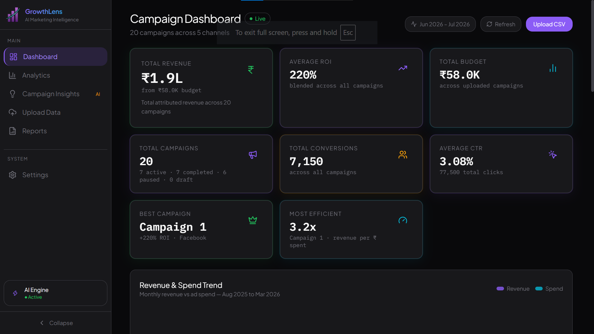
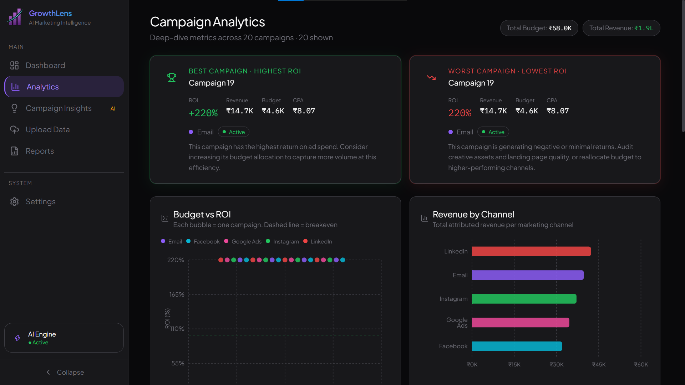
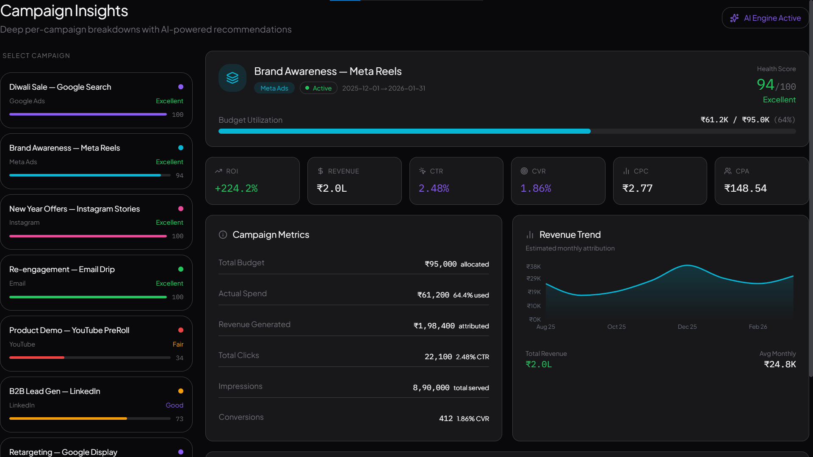
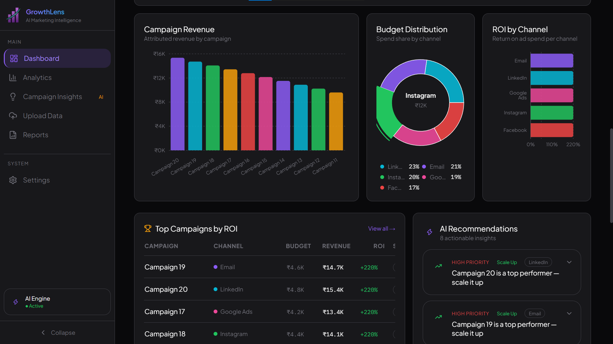

#  GrowthLens

> AI-Powered Marketing Decision Intelligence Platform

GrowthLens is a full-stack AI-powered marketing analytics platform that transforms raw campaign data into actionable business insights. Instead of simply displaying charts, it explains campaign performance, recommends optimization strategies, and predicts future outcomes using machine learning.

---

## 🌐 Live Demo

https://growth-lens-psi.vercel.app/

---

## ✨ Features

### 📊 Interactive Dashboard
- Live KPI dashboard
- Revenue, ROI & performance tracking
- Dynamic charts
- Campaign overview table

### 📁 CSV Campaign Upload
- Upload marketing campaign datasets
- Automatic validation
- Dataset management
- Persistent storage (SQLite)

### 📈 Analytics Engine
Automatically calculates:

- ROI
- CTR
- Revenue
- Profit
- Budget Efficiency

Portfolio-level insights include:

- Best Campaign
- Worst Campaign
- Top / Bottom Performers
- Highest / Lowest ROI

---

### 🤖 AI Recommendation Engine

Rule-based recommendation system that suggests actions such as:

- Scale campaign
- Pause campaign
- Increase budget
- Reduce budget
- Improve CTR
- Improve Conversion Rate

Each recommendation is prioritized based on campaign performance.

---

### 🧠 Machine Learning Campaign Simulator

Uses Ridge Regression to predict campaign performance before spending money.

Predicts:

- Revenue
- Clicks
- Conversions
- ROI
- CVR
- Success Score

Includes confidence estimation based on available training data.

---

### 📑 Reports

Generate:

- CSV Reports
- PDF Reports

Includes:

- KPI Summary
- Revenue Trends
- Channel Performance
- AI Recommendations

---

### 🔍 Campaign Insights

Per-campaign performance dashboard including:

- ROI
- CTR
- CPC
- CPA
- CVR
- Revenue
- Profit
- AI Recommendations

---

## 🛠 Tech Stack

### Frontend

- Next.js
- React
- TypeScript
- Tailwind CSS
- Recharts

### Backend

- FastAPI
- SQLAlchemy
- SQLite
- Pandas
- Scikit-learn

### Deployment

- Vercel
- Render

---

## 📂 Project Structure

```
GrowthLens
│
├── backend/
│   ├── app/
│   ├── database/
│   ├── services/
│   ├── models/
│   └── routers/
│
├── src/
│   ├── app/
│   ├── components/
│   ├── lib/
│   └── providers/
│
└── public/
```

---

## 🚀 Getting Started

### Clone

```bash
git clone https://github.com/Sarthak-2085/GrowthLens.git
cd GrowthLens
```
---

### Backend

```bash
cd backend

python -m venv .venv

# Windows
.venv\Scripts\activate

pip install -r requirements.txt

uvicorn app.main:app --reload
```

Backend runs on

```
http://localhost:8001
```

---

### Frontend

```bash
npm install

npm run dev
```

Frontend runs on

```
http://localhost:4028
```

---

## 📡 API Endpoints

### Health

```
GET /api/health
```

### Upload

```
POST /api/upload
```

### Analytics

```
GET /api/analytics/summary

GET /api/analytics/recommendations
```

### Machine Learning

```
GET /api/ml/status

POST /api/ml/predict
```

---
## 📸 Screenshots

### Dashboard


### Analytics


### Campaign Insights


### ML Simulator


---

## 🎯 Future Improvements

- User Authentication
- Multi-user Workspaces
- Persistent Cloud Database
- AI Chat Assistant
- Real-time Data Integrations
- Custom Dashboards
- Advanced Forecasting Models

---

## ⚠️ Known Limitations

- Authentication is not implemented.
- SQLite on Render Free uses ephemeral storage, so uploaded demo data may not persist across redeployments.
- Designed as a portfolio/demo application.

---

## 👨‍💻 Author

**Sarthak**

Built as a portfolio project demonstrating full-stack development, analytics, machine learning, and AI-powered decision support.

---

## 📄 License

MIT License
